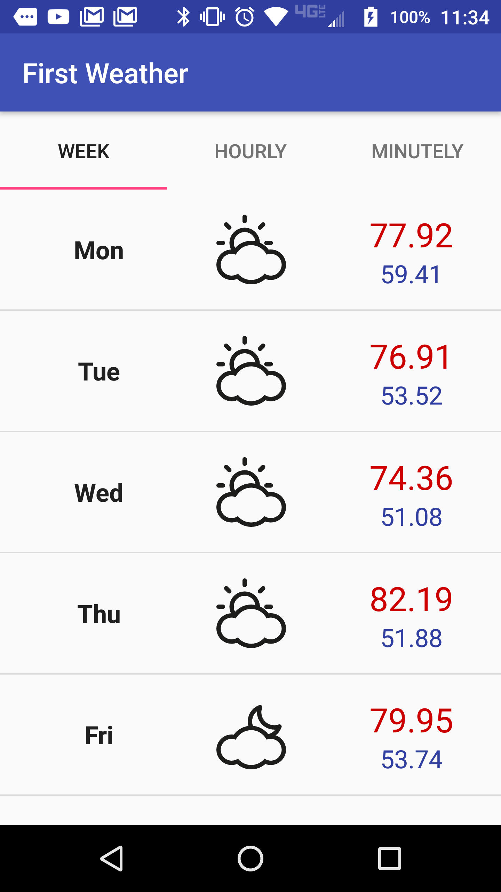

# FirstWeather

Been trying to pick Android back up and a weather app seemed like the easiest endeavor. Some of the things I wanted were to use some weather API [darksky.net](https://darksky.net), some icons [meteocons](http://www.alessioatzeni.com/meteocons/#). I also wanted to use some app features like GPS, Orientation, and SQLite.

## Screenshot

